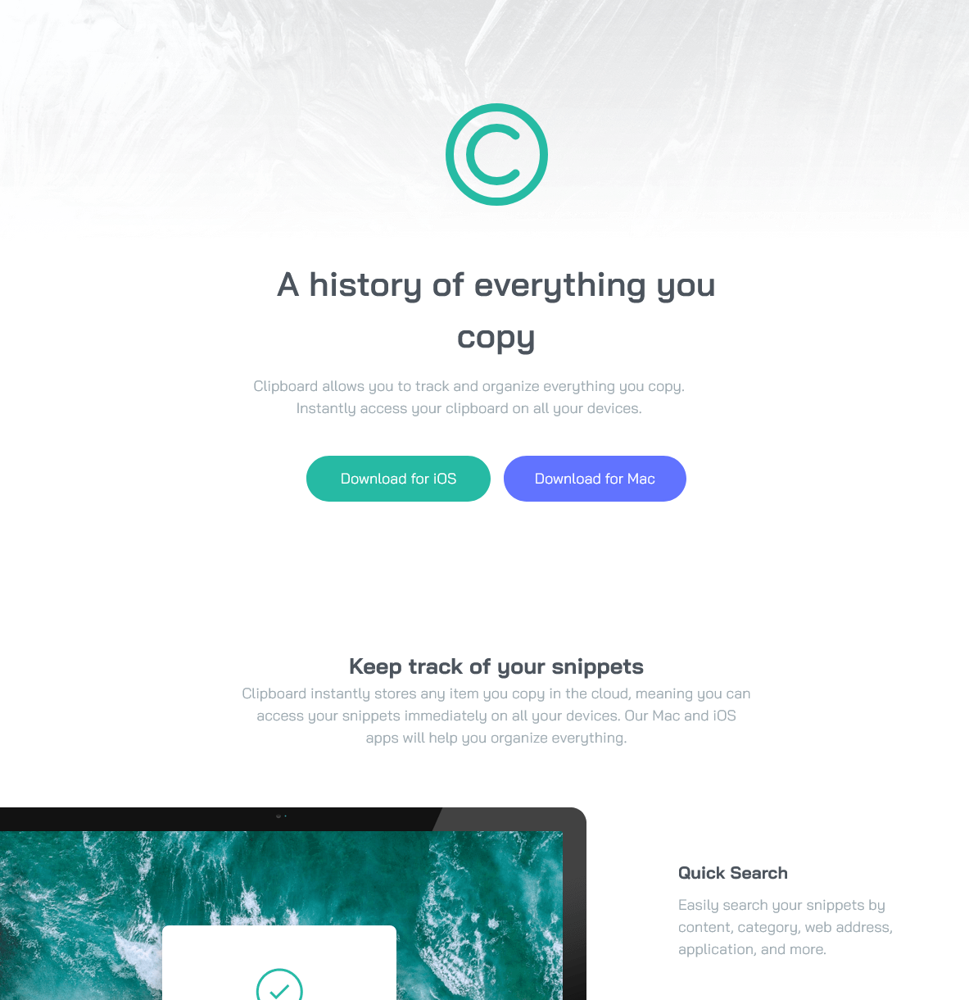

# Frontend Mentor - Clipboard landing page solution

This is a solution to the [Clipboard landing page challenge on Frontend Mentor](https://www.frontendmentor.io/challenges/clipboard-landing-page-5cc9bccd6c4c91111378ecb9).

## Table of contents

- [Overview](#overview)
  - [The challenge](#the-challenge)
  - [Screenshot](#screenshot)
  - [Links](#links)
- [My process](#my-process)
  - [Built with](#built-with)
  - [What I learned](#what-i-learned)
  - [Continued development](#continued-development) 
- [Author](#author)
- [Acknowledgments](#acknowledgments)

 

## Overview

 

### Screenshot

 

### Links

- Solution URL: [Clipboard landing page](https://github.com/KenawMarie/front-clipboard-landing-page)
- Live Site URL: [Live site](https://kenawmarie.github.io/front-clipboard-landing-page/)

## My process

### Built with

- Semantic HTML5 markup
- CSS custom properties
- Flexbox 
- CSS Grid
 

### What I learned

How to gradual fade image into the background-color using CSS gradient and background-image.
 
 

 

### Continued development

I wanna built more projects to improve my skill.
 

## Author

- Website - [kenaw-github](https://github.com/KenawMarie)
- Frontend Mentor - [@kenawMarie](https://www.frontendmentor.io/profile/kenawMarie) 

 

## Acknowledgments

Thanks to the frontend mentor for this challenge.